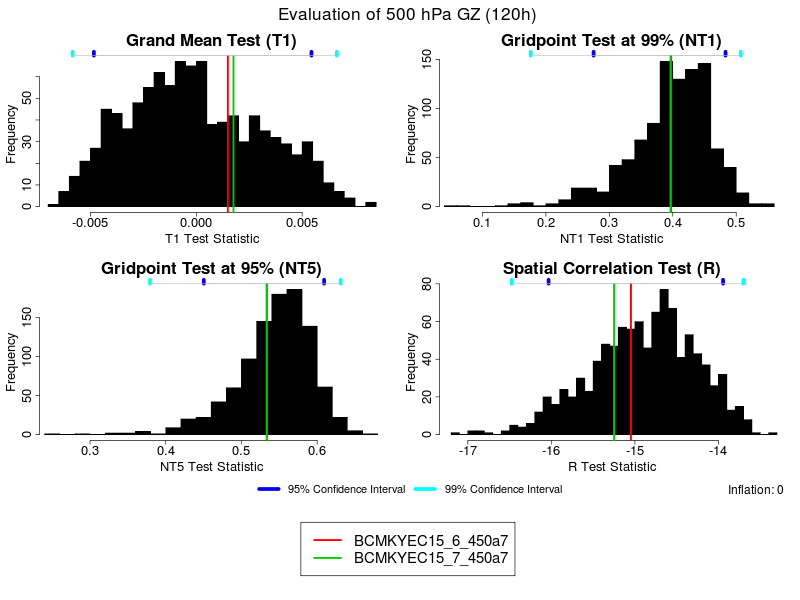
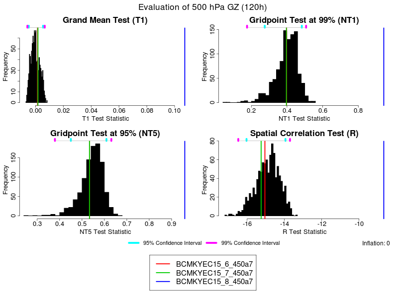

# User's Guide to the Statistical Verification Package

This User Guide is intended to help users construct their own benchmark data and make comparisions with it.  More detailed information about the implementation of the package itself is available in the [[sverif/techdoc|Technical Documentation]] intended for developers.

* [General Description of the Package](#general-description-of-the-package)
* [Preparation of the Statistics](#description-of-the-statistics)
* [Description of the test statistics](#description-of-the-test-statistics)
* [Inflation of the results](#inflation-of-the-results)
* [Evaluation of New Results](#evaluation-of-new-results)
* [Utilities](#utilities)
   * [The sverif_prep utility](#the-sverif_prep-utility)  
   * [The sverif_eval utility](#the-sverif_eval-utility)
   * [The sverif_eval.Abs Utility](#the-sverif_evalabs-utility)
* [References](#references)

# General Description of the Package 
The statistical verification package (SVP) assesses whether a field falls withing an expected range of values.  It essentially allows the user to determine definitively whether or not two fields are "similar" to within a certain tolerance (generally the bitpattern).  While the utility of such an application may not be immediately apparent, consider the case of a model developer who is refactoring code.  It is very possible that a change in the order of operations will lead to very slight differences in the results; however, these changes should be at the "noise level" of the precision of the floating point operations performed.  The SVP allows the developer to assess readily the impact that the refactoring has had on the results using a single integration.  This tool does not replace more extensive meterological multi-case comparisions, it simply provides a quick-look assessment of the magnitude of modifications for developers.

## Preparation of the Statistics
For SVP to function properly, a set of realizations (generally model integrations) is needed to define the acceptable range of states.  For example, the GEM model may be run several times (5-10) with different bitpattern perturbations.  Each integrations yields slightly different results that sit within a cloud of "acceptable" values, where acceptable is defined as the range of states that are equally likely given the computational precision of the calculations performed by the model.  The SVP attempts to account for the fact that these solutions are presumably sparsely distributed over state space.

1. It reduces dimensionality by employing a set of four test statistics[^2]/>.
2. It uses case resampling with replacement (bootstrapping) to estimate the underlying probability density estimate (PDE) of the test statistics.

These tasks are accomplished with the [sverif_prep](#the-sverif_prep-utility) utility, which is described in detail below. This is by far the most computationally-intensive component of the SVP since it involves the calcualtion of the test statistics over a large number of samples as part of the bootstrapping procedure.  The code has been parallelized (the ```--threads``` option to [sverif_prep](#the-sverif_prep-utility); however, it can still take up to half an hour to run on large grids.

## Description of the test statistics
The dimensionality reduction afforded by the SVP comes about as a result of the selection of a set of test statistics.  These parameters are chosen based on analyses of spatial fields[^2] and have been shown to discriminate accurately between fields that should and should-not be considered as "noise level" differences.
* NT:  Differences in the overall means of the reference and test datasets are compared.
* NT1:  A gridpoint-by-gridpoint evaluation of the statistical significance of differences between the reference and test datasets is performed using a standard T-test.  All points whose values are statistically different at the 99% level are considered "hits", such that higher NT1 values are associated with test fields with are very different from those of the reference statistics.
* NT5:  As for NT1, but for pointwise differences computed at the 95% significance level.
* R:  A spatial correlation test whose results are log-normalized as ln(1-r), where "r" is a standard spatial correlation coefficient.

Each of these test statistics is computed for each sample of the set of realizations provided when perparing the statistics.  This allows the package to fill in the PDEs of the test statstics, thereby preparing the sample data for comparision with individual test results.

## Inflation of the results
When the set of control realizations is large enough (say 10 or more members, with larger numbers needed for larger perturbations), the test statistic space is reasonably well covered; however, for smaller numbers of members the estimate of the dispersion may be too small.  This is a well-known weakness of the resampling bootstrap technique.  The coverage of the test statistic space can be expanded by employing a parametric component in the bootstrap procedure.  The existing dataset is used to esimate the variance at each grid point, then a Gaussian model is fit to the data.  Instead of taking the grid point value during the resampling, the value is drawn from the modeled distribution at each point.  The assumption of normality is more justified for the state variable distribution (heights for example) than it is for the highly-derived test statistics, as evidenced by the distinct non-normality in the plots shown in the following section.

A scaling factor is applied to the parametric inflation, and is controled as the ```--inflation``` option to [sverif_prep](#the-sverif_prep-utility).   The default value of 0 implies that no inflation is performed and that therefore pure resampling is employed.  Any value of the scaling factor is valid, and is simply applied to the variance when it is used to create the Gaussian model for the gridpoint fit:  inflation > 1 mean that the model has greater spread than suggested by the variance, while inflation < 1 narrows the model to below the estimated variance.

Because of the random nature of the inflation perturbations, the sensitivity of the spatial correlation test statistic (R) will suffer if a large scaling factor is used; however, for small samples weak inflation can eliminate unwanted 0 peaks in the NT1 and NT5 test statistics.

## Evaluation of New Results
During model development, it is common that small code modifications affect the bitpattern of the model results without impacting the meteorology of the solution.  The SVP allows developers to assess the impact of changes from this perspective:  larger, physical adjustments that are expected to make meteorological changes should be assessed with different tools.  One of the main benefits of the SVP is its efficiency in the development process since a single case can be used to assess the nature of the changes once the statistics are [[#Preparation of the Statistics|prepared]].  Clearly, final validation of changes will still require multiple integrations and Arcad-type evaluation.

The comprarison is set up with a null hypothesis that the new field (for example, a 120 h forecast of 500 mb heights) is the same as the expected result.  If the field lies far enough from the range of expected values, then the null hypothesis can be rejected in favour of the alternative hypothesis and it can be stated that the new result is significantly different from the original one.  There are two important and slightly subtle elements involved in the evaluation of this result.  The first is that the SVP can only find that two fields are "singificantly different":  it cannot be used to state that two fields are "the same".  The latter requires equivalence testing[^1] , a technique common that necessitates the definition of an "acceptable" range for each of the test statistics.  During the development of the SVP, it was felt that the standard test for differences is both more readily interpreted and less prone to subjectivity.  The second important detail about the SVP is that the higher-order statistics of the test integration are assumed to remain unchanged from those of the expected solutions.  These quantities (sums of squares, variances '''et cetera''') are needed to compute the test statistics of the new field, and are clearly unknown for a single case.  Since the SVP focuses on identifying significant changes at levels very close to the bitpattern, it was felt that the assumption of the equality of the higher-order moments was justified.

The [sverif_eval](#the-sverif_eval-utility) utility (described in more detail below) allows for the comparison of any number of test results against the (prepared)[#preparation-of-the-statistics] statistics.  The result is a plot showing the quantities of the test statistics and the associated expected PDEs.  A set of user-defined confidence intervals can also be displayed, allowing for a quick determination of the significance of differences between the test and expected results.



In this example, a pair of GEM integrations are performed based on very minor modifications to the baseline configuration for a 15 km Yin-Yang GDPS integration [slight changes to horizontal (red) and vertical diffusion (green) operators].  The results of both 120 h integrations clearly fall well within the range of expected values (the black bars on the plots), near the center of the selected confidence intervals.  In each of these cases, therefore, it would be impossible to reject the null hypothesis that the modifications significantly impact the integration.



In this example a third test is added, one which can be clearly identified as significantly different from the expected results.  Each of the test statistics falls well outside the displayed confidence intervals, allowing for the statement that the "8" result (in blue) is significantly different from the expected results at the 99% confidence level.  Note that the NT1 and NT5 (test statistics)[#description-of-the-test-statistics] are each bounded at 1, while the log-normalization of the R (test statistics)[#description-of-the-test-statistics] practically limits its range of values to approximately between -8 and -9 although it could theoretically reach a value of 0.7 for perfectly anti-correlated fields.

# Utilities
The SVP provides a set of utilities that give users a high level of control over the functionality of the package.

## The sverif_prep utility
This utility is designed to help with the generation of the PDE that describes the range of expected values for the (test statistics)[#description-of-the-test-statistics].  To get a list of possible options, type:
```bash
 sverif_prep -h
```
In addtion to these options, the utility expects a list of input data files.  Each input file is considered a separate realization and is included in the calculation of the testc statistics and the bootstrapping procedure.  Depending on the number of members in the bootstrap ```--boot`, the number of execution threads ```--threads``` and the size of the grid, the [sverif_prep](#the-sverif_prep-utility) utility can take quite a while to run.  For example, a global 15 km grid takes about 20 min on eight cores for a 1000-member sample.

The output of this utility consists of a pair of files.  By default, the output is written to the directory identified by the ```SVERIF_STATPATH``` environment variable.  This can be overridden with the ```--statpath``` option to [sverif_prep](#the-sverif_prep-utility).  The environment variable serves as a default to allow external packages to define a base for subsequent comparisons.

A typical invocation might look like this:
```bash
sverif_prep --level=250 --boot=500 --threads=8 $(find /path/to/my/runs -name "prgdp*120" -print0)
```
This would run the preparatory calculations for 500 samples of the original dataset, using the day-5 forecasts of the 250 mb height field to compute the test statistics (note the default values of the ```--name``` and ```--prog``` options). The results of the ```find``` are used to define the data files used for the calculations. If the ```SVERIF_STATPATH``` is undefined, then the above command will stop and require that the option ```--statpath``` be defined.

## The sverif_eval utility
This utility compares the values of the (test statistics)[#description-of-the-test-statistics] of a single (or set of) fields with the expected values obtained during the preparation step (the output of the[sverif_prep](#the-sverif_prep-utility) utility).  To get a list of possible optinos, type:
```bash
sverif_eval -h
```
In addtion to these options, the utility expects a list of input data files.  Each input file is treated separately and added to the plots generated by the utility (defined with the ```--output``` option).  The confidence intervals specified as options to ```sverif_eval``` are for plot purposes only, and do not affect the way that the values are computed.  

As for [sverif_prep](#the-sverif_prep-utility), the environment variable ```SVERIF_STATPATH``` is used to define the directory containing pre-calculated statistics for the control fields (the output from [sverif_prep](#the-sverif_prep-utility)).  This variable can be overridden with the ```--statpath``` option to ```sverif_eval```.

A typical invocation might look like this:
```bash
sverif_eval --level=250 /path/to/my/new/run_1/prgdp*120 /path/to/my/new/run_2/prgdp*120
```
This would compare the (test statistics)[#description-of-the-test-statistics] from two new datasets to the original "expected" values.  The result will be a plot named ```verif.png``` (the default, changed with the ```--output``` option) in the local directory.

## The sverif_eval.Abs Utility
The direct access to this component of the SVP is intended for minimalist configurations only.  To get usage information, type:
```bash
sverif_eval.Abs
```
Instead of generating plots as output, this utility dumps information about the computed test statistics and the results of a set of pass/fail tests based on the confidence intervals specified when [sverif_prep](#the-sverif_prep-utility) was called.

A typical invocation might look like this:
```bash
sverif_eval.Abs GZ 250 120 /path/to/my/new/run_1/prgdp*120 $SVERIF_STATPATH
```
This would compare the (test statistics)[#description-of-the-test-statistics] from a new dataset to the original "expected" values, and produce a text report of the result on ```stdout```.

# References
[^1]: Limentani, G. B., M. C. Ringo, F. Ye, M. L. Bergquist and E. O. McSorley, 2005:  Beyond the t-Test: Statistical Equivalence Testing.  ''Anal. Chem.'', '''77''', 221-226.
[^2]: Wigley, T. M. L., and B. D. Santer, 1990:  Statistical comparison of spatial fields in model validation, perturbation and predictability experiments.  ''J. Geophy. Res.'', '''95''', 851-865.
